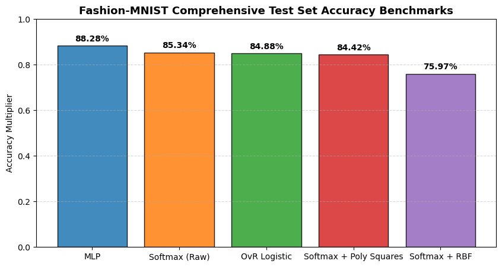
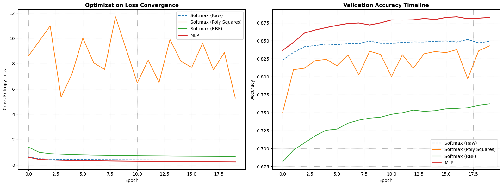
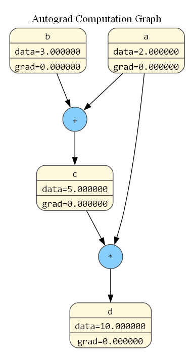

# MiniML: A NumPy-Based Machine Learning Framework

A machine learning framework implemented from scratch using NumPy.

MiniML includes classical machine learning algorithms, feature engineering utilities, model selection tools, a reverse-mode automatic differentiation engine, and a lightweight neural network framework.

No PyTorch, TensorFlow, or scikit-learn models are used for training.

---

## Features

### Classical Machine Learning

- Logistic Regression (SGD)
- Perceptron
- Least Squares Classifier
- Linear Discriminant Analysis (LDA)
- Ridge Regression
- Bayesian Regression
- Gaussian Naive Bayes
- Bernoulli Naive Bayes

### Data Processing

- StandardScaler
- Polynomial Features
- Gaussian Basis Features (RBF)

### Model Selection

- Train/Test Split
- K-Fold Cross Validation

### Neural Networks

- Reverse-Mode Automatic Differentiation
- Linear Layers
- ReLU
- Sigmoid
- Softmax
- Sequential Containers
- SGD Optimizer
- Binary Cross Entropy Loss
- Cross Entropy Loss

---

## Fashion-MNIST Benchmark

The framework was evaluated on the Fashion-MNIST image classification benchmark.

| Model | Test Accuracy |
|---------|---------:|
| MLP | **88.28%** |
| Softmax Regression | **85.34%** |
| OvR Logistic Regression | **84.88%** |
| Softmax + Polynomial Features | **84.42%** |
| Softmax + Gaussian Basis Features | **75.97%** |

### Model Performance



### Training Dynamics



---

## Reverse-Mode Automatic Differentiation

MiniML includes a custom reverse-mode automatic differentiation engine capable of building computation graphs and performing backpropagation.

### Example Computation Graph



A larger neural network computation graph can also be generated using the visualization utilities provided in the repository.

---

## Quick Example

```python
import numpy as np
from mini_ml.nn import Sequential, Value
from mini_ml.nn.modules import Linear, ReLU
from mini_ml.nn.losses import CrossEntropyLoss
from mini_ml.nn.optimizers import SGD

model = Sequential(
    Linear(784, 128),
    ReLU(),
    Linear(128, 10),
)

loss_fn = CrossEntropyLoss()
optimizer = SGD(model.parameters(), lr=0.01)

# Training loop
for epoch in range(10):
    X_val = Value(X_train)
    logits = model(X_val)
    loss = loss_fn(logits, y_train)

    optimizer.zero_grad()
    loss.backward()
    optimizer.step()

    print(f"Epoch {epoch+1:>2} | Loss: {float(loss.data):.4f}")
```

---

## Installation

Clone the repository:

```bash
git clone https://github.com/ve-ct-07/mini-ml-framework.git
cd mini-ml-framework
```

Install dependencies:

```bash
pip install -r requirements.txt
```

---

## Requirements

- Python 3.10+
- NumPy
- Pandas
- Matplotlib
- Graphviz
- Scikit-Learn

Install manually:

```bash
pip install numpy pandas matplotlib graphviz scikit-learn
```

---

## Graph Visualization

Generate autograd computation graphs:

```bash
python scripts/graphviz_visualizer.py
```

For graph rendering, install Graphviz:

### Ubuntu

```bash
sudo apt install graphviz
```

### Windows

Download Graphviz:

https://graphviz.org/download/

Ensure the `dot` executable is available in your system PATH.

---

## Repository Structure

```text
mini-ml-framework/
│
├── mini_ml/
│   ├── datasets/
│   ├── preprocessing/
│   ├── linear_models/
│   ├── naive_bayes/
│   ├── model_selection/
│   └── nn/
│
├── notebooks/
│   └── capstone_showdown.ipynb
│
├── scripts/
│
├── tests/
│
├── assets/
│
├── README.md
├── LICENSE
├── pyproject.toml
└── requirements.txt
```

---

## Dataset

Fashion-MNIST data files are not included in the repository.

Place dataset files inside:

```text
data/
```

before running experiments.

---

## Testing

Run all tests:

```bash
pytest tests/
```

Example:

```bash
pytest tests/test_logistic_regression.py
```

---

## Design Goals

- Educational implementation of machine learning algorithms
- Minimal dependencies
- Readable and modular code
- Reproducible experiments
- Demonstration of machine learning fundamentals from first principles

---

## Limitations

MiniML is intended for learning and experimentation.

It prioritizes clarity and educational value over the performance optimizations found in production frameworks such as PyTorch, TensorFlow, and JAX.

---

## License

This project is licensed under the MIT License.

See the LICENSE file for details.
